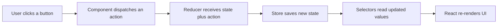

# Article 1: The Day Your Cart State Outgrew Props

You start building a clean React app.

At first, everything feels easy. One component holds some state, passes props down, and the UI responds. Smooth.

Then the app grows.

Now the cart count in the header needs the same data as the cart panel. Product cards need to update that data. Another component needs totals. Suddenly, you are not building UI anymore. You are managing data traffic.

That is the moment Redux starts making sense.

## What Redux really is

Redux is a state management library, but that definition is too dry. Think of it like this:

- the store is your single source of shared truth
- actions describe what happened
- reducers decide how state should change
- selectors read exactly what each component needs

Redux gives structure to shared state, so updates stay predictable even when the app gets bigger.

In this project, cart state is shared between multiple places, so this is an ideal beginner use case.

## Why developers reach for Redux

In small apps, local state is usually enough.

In growing apps, these pain points appear:

- multiple components need the same data
- prop drilling gets noisy
- update logic spreads across files
- debugging "who changed what" becomes painful

Redux solves this by forcing a one-way flow that you can reason about.

## The architecture in one glance



This one-way flow is the core reason Redux feels reliable once you learn it.

## The pattern you will learn in this project

You will not learn random Redux facts. You will follow the same order teams use in real codebases:

1. create a feature slice
2. configure the store
3. export TypeScript helper types
4. create typed hooks
5. wrap app with Provider
6. dispatch actions from components
7. read and derive state through selectors

That means you can code along from Article 2 onward without guessing "what should come first?"

## When Redux is a good choice (and when it is not)

Use Redux when:

- shared state spans multiple components
- update rules are becoming complex
- you want predictable state transitions

Skip Redux when:

- state is local and simple
- app is very small
- React local state already solves the problem cleanly

Good engineering is not "always use Redux." It is "use Redux when shared state complexity justifies it."

## Why TypeScript makes Redux much better

Redux plus TypeScript gives practical safety where beginners usually struggle:

1. state shape safety
2. payload safety
3. dispatch and selector safety

You get clearer autocomplete, safer refactors, and fewer runtime surprises.

## Syntax you will see repeatedly

You do not need to memorize everything now, but these patterns will appear often:

```ts
type RootState = ReturnType<typeof store.getState>;
type AppDispatch = typeof store.dispatch;
```

```ts
createSlice({ ... })
configureStore({ ... })
PayloadAction<T>
```

```ts
dispatch(addToCart(...))
useCartSelector((state) => state.cart.items)
```

## What you are building in this learning project

You will build a car-parts cart flow where readers can follow real implementation, step by step:

- list products
- add items to cart
- remove items from cart
- show cart quantity in header
- calculate and show cart total

The UI exists to support learning Redux + TypeScript, not the other way around.

## The 5-part series roadmap

Here is your guided path:

1. Article 1 (this article): Redux foundations, series plan, and project structure
2. Article 2: build `store.ts` and `cart-slice.ts`
3. Article 3: add typed hooks and Provider wiring
4. Article 4: dispatch actions from UI components
5. Article 5: selectors, derived values, and full update flow

Each part is intentionally scoped so beginners can code with confidence and not get overloaded.

## Project structure you will work with

```text
src/
├── App.tsx
├── dummy-products.ts
├── components/
│   ├── Header.tsx
│   ├── Product.tsx
│   ├── Cart.tsx
│   ├── CartItems.tsx
│   └── Shop.tsx
└── store/
    ├── store.ts
    ├── cart-slice.ts
    └── hooks.ts
```

How to read this:

- `store/` is Redux core logic
- `components/` dispatch actions and select state
- `App.tsx` connects everything through Provider

## Covered so far

You now understand:

- what Redux is in real app terms
- why one-way data flow matters
- when to use Redux and when not to
- why TypeScript is a major advantage
- the exact 5-article implementation path
- the file structure you will use while coding

## Next article

In Article 2, you will write your first real Redux layer:

- create store configuration
- define cart slice state and reducers
- export typed state and dispatch helpers

That is where the implementation actually begins.