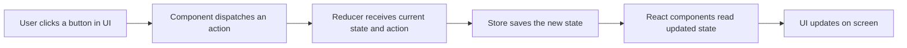

# Understanding Redux

When people first hear the word Redux, it often sounds more complicated than it really is. Redux is not a replacement for React. It is a tool that helps you manage data in a more predictable and organized way.

If your app is small, Redux can feel unnecessary. But as your app grows, keeping track of shared data between many components can become difficult. That is where Redux becomes useful.

This article explains what Redux is, how its architecture works, why developers use it, and when it makes sense to bring Redux into a project.

## What is Redux?

Redux is a **state management library**.

In simple words, Redux gives your app one central place to store shared data. That central place is called the **store**.

Instead of passing data through many components again and again, Redux allows different parts of the app to read from the same store and update it in a controlled way.

You can think of Redux as a central data box for your application.

Examples of data that might go into Redux are:

- shopping cart items
- logged-in user information
- theme settings
- product filters
- wishlist data

## What is state?

Before understanding Redux, it helps to understand the word **state**.

State means data that can change over time.

For example:

- whether a user is logged in or logged out
- how many items are in the cart
- whether a modal is open or closed
- which product category is selected

React already has its own state system using tools like `useState`. Redux is used when state becomes more shared, more complex, or harder to manage across many components.

## Why was Redux created?

In React apps, data often starts in one component and needs to be passed down to other components through props.

This works well in small apps.

But in bigger apps, a few problems can appear:

- too many components need the same data
- props have to be passed through many layers
- updating shared data becomes harder to track
- debugging state changes becomes confusing

Redux was created to solve this by giving the app one predictable flow for reading and updating shared state.

## The main idea behind Redux

Redux follows a simple idea:

- keep shared state in one central store
- do not change that state directly
- describe what happened using an action
- let Redux update the state in a predictable way

This makes state updates easier to follow.

## Redux architecture diagram

Here is a beginner-friendly view of the Redux data flow:



This is called a **one-way data flow**.

That means data moves in one clear direction, which makes the app easier to understand.

## Important Redux parts

To understand Redux, you should know these core pieces.

### 1. Store

The store is the central place where Redux keeps state.

You can think of it as the main memory box for shared app data.

There is usually one Redux store for the app.

### 2. Action

An action is a plain object that describes **what happened**.

Examples:

- add item to cart
- remove item from cart
- log user in
- clear filters

An action does not directly change the state. It only describes the event.

### 3. Reducer

A reducer is a function that decides how the state should change.

It receives:

- the current state
- the action

Then it returns the new state.

So the reducer answers this question:

"Now that this action happened, what should the new state look like?"

### 4. Dispatch

Dispatch means sending an action to Redux.

For example, when a user clicks an "Add to Cart" button, a component can dispatch an action like:

```text
cart/addItem
```

Redux then sends that action to the reducer.

### 5. Selector

A selector is a way to read data from the Redux store.

For example, a cart component may read:

- total cart items
- cart products
- total price

Selectors help components get exactly the data they need.

## A simple real-world example

Imagine you are building an online store.

You may have:

- a product list component
- a cart icon in the header
- a cart details panel

If a user adds one item to the cart, several parts of the app need to know that:

- the cart count in the header should update
- the cart list should update
- the total price should update

Redux helps by storing the cart in one shared place. Any component that needs cart data can read from the same store.

That means you do not need to pass cart data through many unrelated components.

## Why use Redux?

Redux is useful because it brings structure.

Here are the main reasons developers use Redux:

- shared state stays in one central place
- state updates are predictable
- debugging becomes easier
- large apps become easier to manage
- components become less dependent on long prop chains

In short, Redux helps reduce confusion when many parts of the app need the same data.

## When should you use Redux?

Redux is helpful when:

- many components need the same state
- state logic is becoming complex
- the app has features like cart, auth, filters, or dashboards
- you want a more predictable pattern for updates
- debugging shared state is getting difficult

For example, Redux is a good fit for:

- e-commerce carts
- user authentication state
- admin dashboards
- large forms with shared data
- apps with many screens sharing the same data

## When should you not use Redux?

Redux is not required for every React app.

If your app is small and the state is simple, React's built-in state tools may be enough.

For example, you may not need Redux when:

- state is only used inside one or two components
- prop passing is still simple
- the app is very small
- there is no complex shared state yet

This is important for beginners: using Redux too early can add extra code and mental load.

So the better rule is not "always use Redux." The better rule is "use Redux when shared state becomes hard to manage."

## Is Redux the same as React Context?

No. They are related, but not the same.

React Context helps share data without passing props manually through every level.

Redux does more than that. It provides:

- a central store
- a strict update flow
- predictable state updates
- better patterns for larger shared state needs

For very small shared data, Context may be enough.
For more complex shared state, Redux is often a stronger solution.

## Modern Redux: Redux Toolkit

Today, most Redux projects use **Redux Toolkit** instead of writing classic Redux by hand.

Redux Toolkit makes Redux easier by reducing boilerplate code.

In this project, the package:

```text
@reduxjs/toolkit
```

has already been installed.

This is the recommended way to use Redux now.

It helps with:

- creating the store
- writing reducers more easily
- creating actions automatically
- keeping Redux code cleaner

The package:

```text
react-redux
```

helps React components connect to the Redux store.

## A mental model for beginners

If Redux feels abstract, remember it this way:

- the **store** is the central data shelf
- an **action** is a message saying what happened
- a **reducer** decides how data changes
- **dispatch** sends the message
- React components read the updated data and show it on screen

That is the heart of Redux.

## Final thoughts

Redux is a tool for managing shared state in a clean and predictable way.

It is most useful when your app grows beyond simple local state and many components need access to the same data.

As a beginner, you do not need to fear Redux. The best way to understand it is to see it as a system with a clear flow:

- something happens in the UI
- an action is dispatched
- Redux updates the store
- components read the new state
- the UI updates

Once that flow becomes clear, Redux becomes much easier to understand.